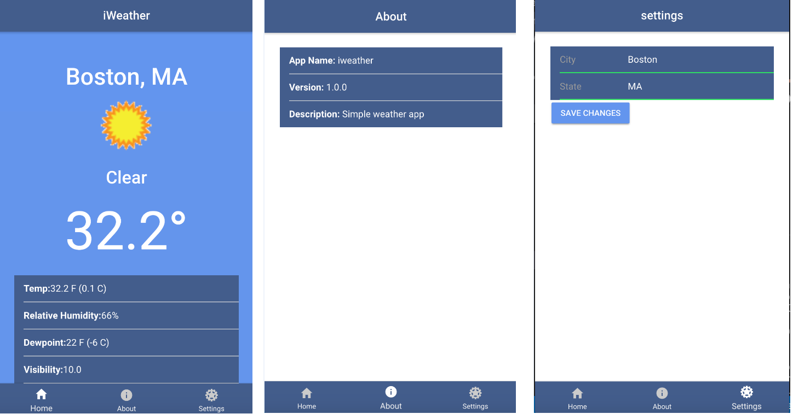

# ionic3
building mobile weather app using Ionic 3 and angular4 by using the API from wunderground.com, we created a provider to reach out to the API and return and display data using Ionic localStorage Module

